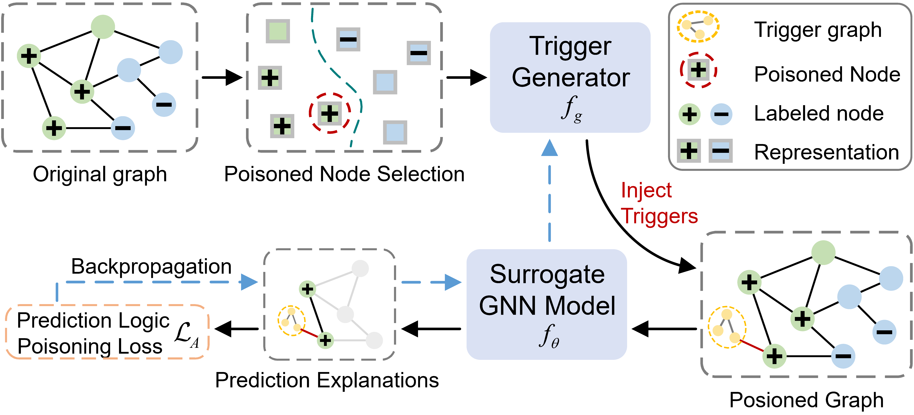

# Clean-Label Backdoor Attacks by Poisoning the Inner Prediction Logic of Graph Neural Networks

## Announcement
This anonymous repository is only used for submissions to THE WEB CONFERENCE 2025.

## Introduction
We propose an effective clean-label graph backdoor attack method, BA-Logic, by poisoning the inner logic of target models.



## Independencies

- Python 3.7+
- PyTorch 2.0.1
- PyTorch Geometric 2.5.2

## Usage

To run the BA-Logic model with a specific task, use the following command:

```bash
python run_clip.py
```

You can modify `run_clip.py` to change the input data or the task being performed.
